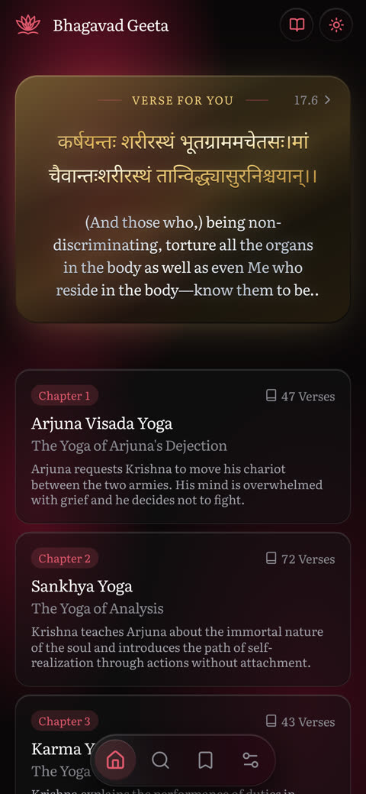
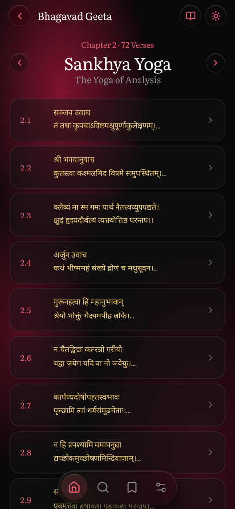
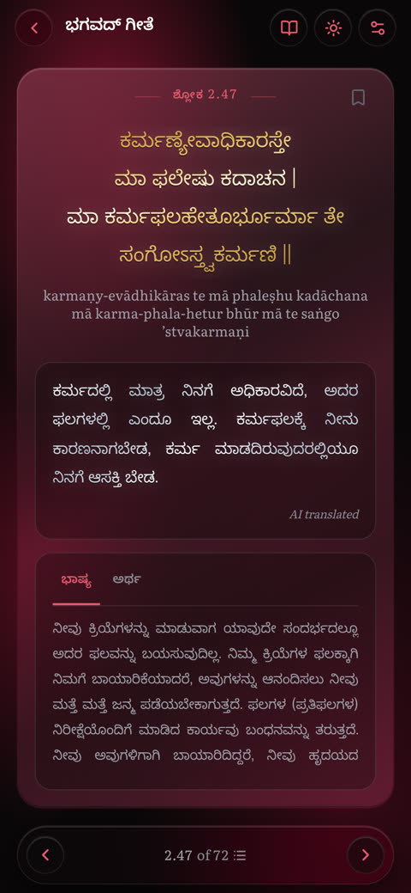
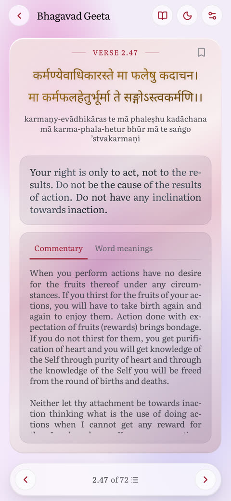
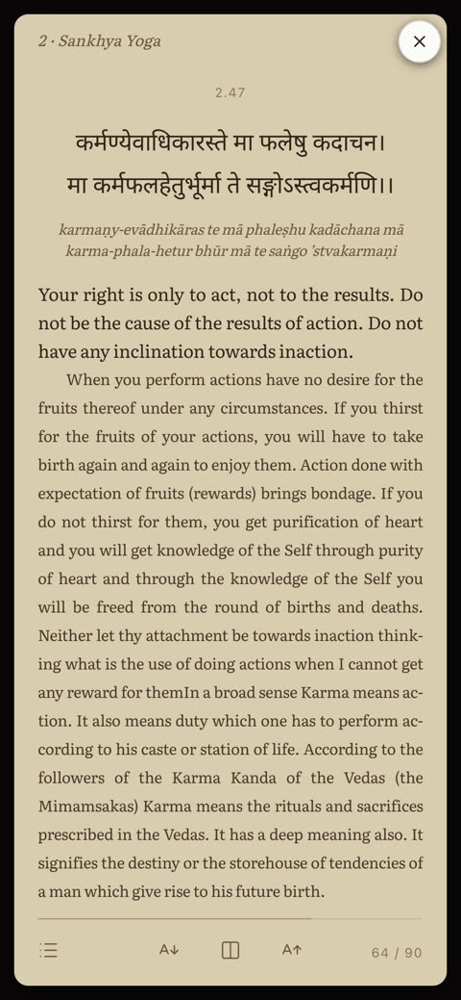
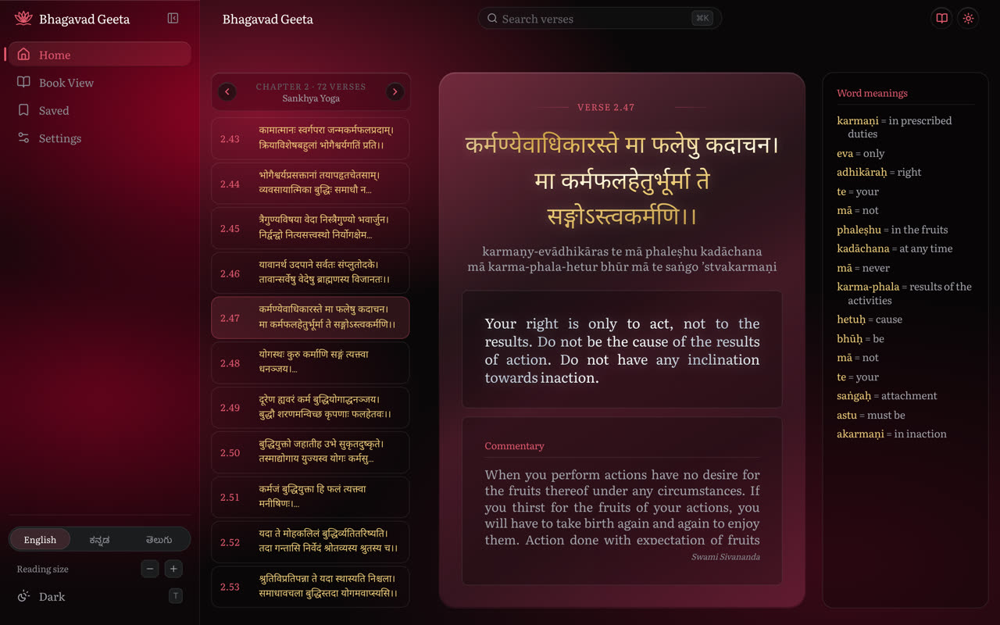
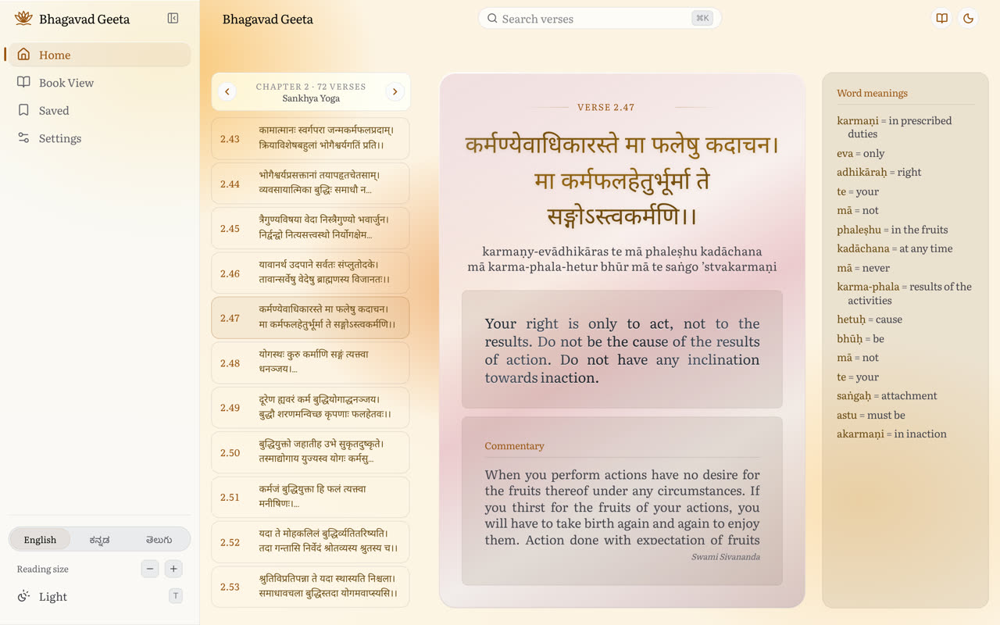
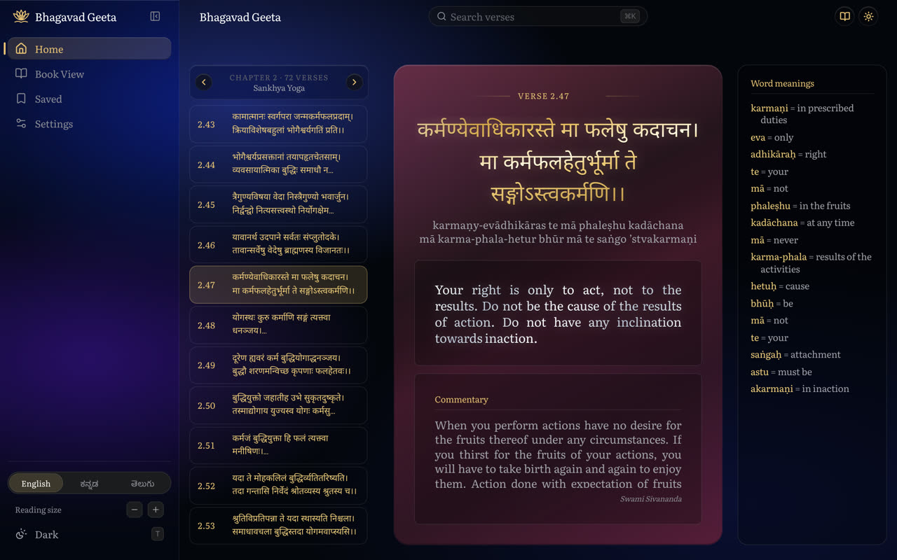

# Geeta

Repo: bhagavad-geeta

An offline-capable web reader for all 701 verses of the Bhagavad Gita, for people who want the Sanskrit alongside a Kannada or Telugu rendering.

The whole corpus is generated into static JSON at build time, so the reader works from the service-worker cache with no backend.

[Docs](docs/)


## Screenshots

On a phone: the chapter list, a chapter's verses, a verse in Kannada, light mode, and book mode.

<p>
  
  
  
  
  
</p>

On desktop: three themes, each in dark and light. Shown are Kumkum dark, Saffron light and Nila dark.

<p>
  
  
  
</p>

## Requirements

- Node `^20.19.0 || >=22.12.0` (Vite 7)
- Nothing else to run the app: no database, no API key, no account
- `ANTHROPIC_API_KEY` or `DEEPSEEK_API_KEY` only if you run the translation bakeoff scripts under `scripts/bakeoff/`
- A Cloudflare account and a separately installed `wrangler` only if you deploy

## Run it

```bash
git clone https://github.com/nvkudva/bhagavad-geeta.git
cd bhagavad-geeta
npm install
npm run dev
```

`predev` runs `scripts/build-data.mjs` first, which regenerates `public/data/v1/` from `src/data/verses.json`. The dev server prints a localhost URL; the home screen shows the 18 chapters and a verse card.

`npm run build` typechecks, bundles, then runs `npm run size`, which fails the build if any bundle exceeds its gzip budget. `wrangler deploy` ships `dist/` to Cloudflare Workers as a single-page app, per `wrangler.toml`.

## Configuration

There are no runtime environment variables. Language and theme are chosen in the app and stored in `localStorage`; `?lang=kn` on any URL is a one-shot override consumed at boot.

| Variable | Required | What it is |
|---|---|---|
| `ANTHROPIC_API_KEY` | No | `scripts/bakeoff/run-claude.mjs` only — translation candidate generation |
| `DEEPSEEK_API_KEY` | No | `scripts/bakeoff/run-deepseek.mjs` only — same, other provider |

## How it works

`scripts/build-data.mjs` reads the 6 MB canonical `src/data/verses.json` and writes per-chapter files into `public/data/v1/`, splitting commentary into its own files so the reader's first paint does not pay for it. The build validates as it goes: unknown fields, duplicate references, gaps in the verse sequence and script-mismatched translations all fail it. An ESLint rule forbids importing `verses.json` from `src/`, which is what keeps the corpus out of the bundle.

At runtime, `src/lib/gita.ts` is the only module that fetches verse data, and it memoises and de-duplicates in flight. `src/lib/router.tsx` is a hand-written History API router, about 300 lines. State lives in three module-level stores (`router`, `bookmarks`, `history`) read through `useSyncExternalStore`, plus a React context for settings; there is no state library. `src/components/VerseViewer.tsx` holds two readers behind a width check: a card pager on phones and a scrolling column on desktop.

## Status

Working: the reader in both layouts, chapter browsing, search, bookmarks, reading history, a settings screen, light and dark themes, and PWA install with offline precache. Corpus coverage counted from `src/data/verses.json` on 2026-09-07 — scripture and translation 701/701 in all three scripts, English commentary 700/701, Kannada and Telugu commentary 695/701 each. `public/data/v1/manifest.json` recounts this on every build and is the authoritative figure.

Not built: there are no tests, no test runner and no CI, so nothing enforces lint, typecheck or the size gate before a deploy. There is no error boundary, and a chapter fetch that fails leaves the reader on its loading line with no retry. Word-by-word glosses are the remaining corpus gap: English 701/701, but Telugu 22/701 and Kannada 4/701.

The gzip figures in `scripts/check-size.mjs` (84 KB initial JS, 12 KB lazy JS, 10 KB blocking CSS, 7 KB desktop CSS) are enforced ceilings, not measured page weights.

## License

No licence file yet — all rights reserved.

The Telugu translations are imported from te.wikisource under CC BY-SA 4.0 (see `src/lib/gita.types.ts` and `scripts/data-sources/`); three verses were composed instead and carry no Wikisource credit. Attribution is shown in the app.
